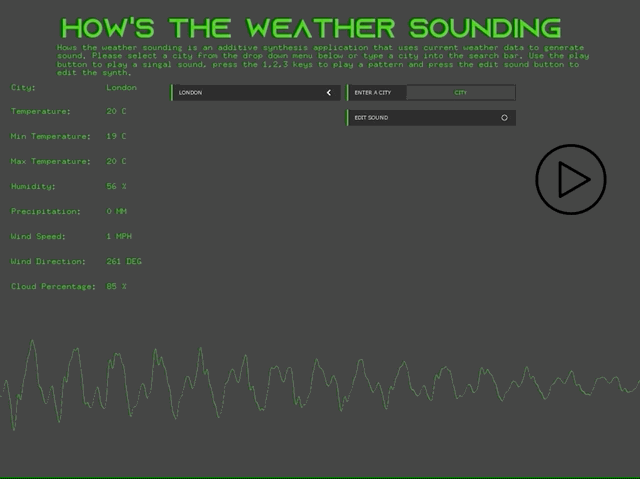
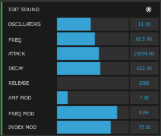

# Audio-Synthesizer-Hows-The-Weather-Sounding

## Overview

Hows The Weather Sounding, is an audio synthesizer application that generates sound through algorithmic composition by converting weather data into sound. The application is written in C++ using the framework openFrameworks. 

**Original repo:** https://gitlab.doc.gold.ac.uk/mnewc002/creative-projects-term-2-michael-athar

**Video link:** https://vimeo.com/436095416



## Features

**Weather data**

The application uses the following weather data, temperature, min temperature, max temperature, humidity, precipitation, wind speed, wind direction, and cloud percentage to create sound by converting this data into numerical values that be used by a synthesizer. The application fetches the weather data in JSON format through the OpenWeatherMap API. More information regarding this API can be found [here](https://openweathermap.org/api). The sound is then generated through additive synthesis. 

The weather data the application uses is, based on the current weather in a city. The application comes with 10 different default cities that the user can choose from using the drop-down menu. In addition to this, the user can type in the name of a city using the search bar. 


**Fine-tuning a sound**

For users that have some experience with sound synthesis, the user can fine-tune the sound by changing the parameters of the synthesizer. This feature is, hidden by default but can be easily accessed by pressing the ```EDIT SOUND``` button. 



## Setup

**Prerequisites:**
openFrameworks (should work on lastest if not try v0.10.1),
ofxMaxim, 
ofxJSON,
ofxDatGui

**Step 1:** Download [openFrameworks](https://openframeworks.cc/download/) and follow the setup guide for your OS and IDE.

**Step 2:** Download or clone the additional openFrameworks libraries ([ofxMaxim](https://github.com/micknoise/Maximilian), [ofxJSON](https://github.com/jeffcrouse/ofxJSON), [ofxDatGui](https://github.com/braitsch/ofxDatGui)) into the ```openFrameworks/addons``` directory. 

**Step 3:** Create a new project using the projectGenerator, located in the directory ```openFrameworks/projectGenerator```. Then using the addons button, add ```ofxMaxim```, ```ofxJSON```, ```ofxDatGui``` to the project. 

**Step 4:** Open the project in your IDE then from inside your IDE delete all the files inside the src directory.

**Step 5:** Download or clone this repo then copy the files inside the src directory of this repo into the src directory of the project you created.

**Step 6:** Copy the contents inside the data directory of this repo into the ```bin/data``` directory of the project.  

**Step 7:** Compile the project.
